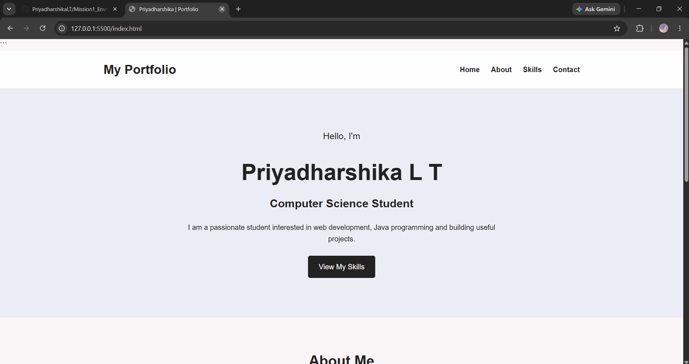
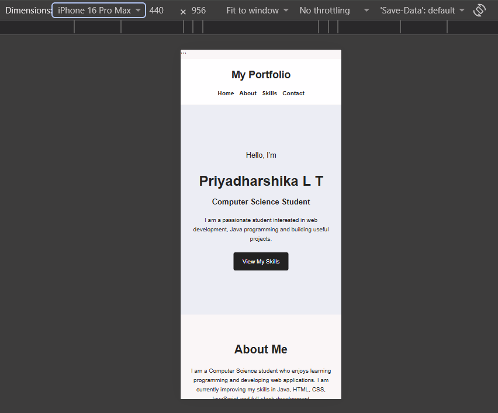

# Responsive Portfolio Landing Page

A simple and responsive personal portfolio landing page built using **HTML and CSS**.

This project was created as part of my **Mission 1 - Web Development Practice** to learn the basics of semantic HTML, CSS layouts, Flexbox, Grid and responsive design.

## 🚀 Features

* Responsive navigation bar
* Personal hero section
* About Me section
* Skills section
* Contact section
* Responsive design for mobile and desktop
* Semantic HTML structure
* Flexbox used for navigation and hero section
* CSS Grid used for skill cards
* Media query for mobile responsiveness

## 🛠️ Technologies Used

* HTML5
* CSS3
* Flexbox
* CSS Grid
* Media Queries
* GitHub Pages

## 📁 Project Structure

```text
responsive-landing-page/
│
├── index.html
├── style.css
├── README.md
│
└── screenshots/
    ├── desktop.png
    └── mobile.png
```

## 💻 How to Run Locally

1. Clone the repository.

```bash
git clone YOUR_REPOSITORY_URL
```

2. Open the project folder.

3. Open `index.html` in a web browser.

No additional installation is required.

## 📱 Responsive Design

The website is designed to work on both desktop and mobile screens.

### Desktop



### Mobile




## 📚 What I Learned

Through this project, I practiced:

* Creating semantic HTML pages
* Creating navigation links
* Styling elements using CSS
* Using Flexbox
* Using CSS Grid
* Creating responsive layouts
* Using media queries

## 👩‍💻 Author

**Priyadharshika L T**


